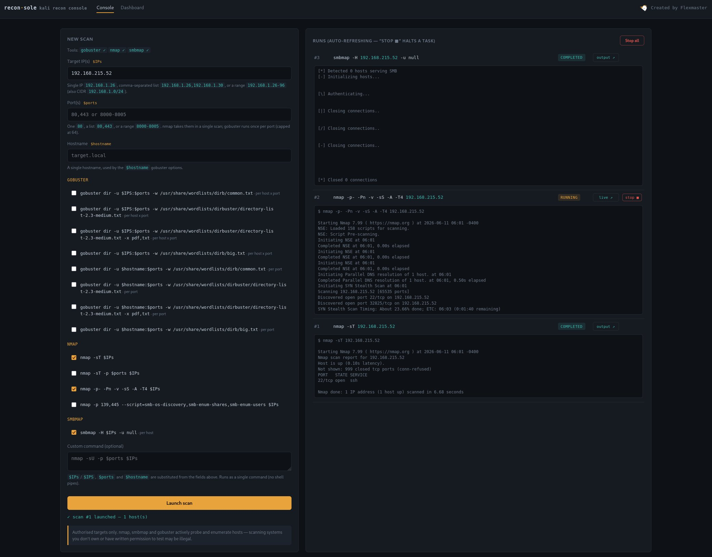
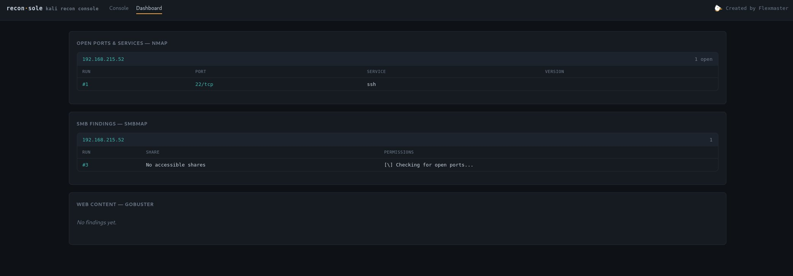

# recon·sole

A self-hosted **network reconnaissance console for Kali Linux**. It gives you a
browser GUI to launch the standard Kali tools (`nmap`, `smbmap`, `gobuster`)
against one or many targets, runs them **concurrently** with **live streaming
output**, stores everything in SQLite, and rolls the results up into a
**dashboard** grouped per target.

> ⚠️ **Authorised targets only.** `nmap`, `smbmap` and `gobuster` actively probe
> and enumerate hosts. Only point reconsole at systems you own or have explicit
> written permission to test — unauthorised scanning may be illegal.



---

## Table of contents

- [Features](#features)
- [Requirements](#requirements)
- [Install](#install)
- [Run it (as root) & open the dashboard](#run-it-as-root--open-the-dashboard)
- [Using the console](#using-the-console)
- [The dashboard](#the-dashboard)
- [➕ Adding / changing the scan commands](#-adding--changing-the-scan-commands)
- [Configuration knobs](#configuration-knobs)
- [How it works (architecture)](#how-it-works-architecture)
- [Database schema](#database-schema)
- [Security notes](#security-notes)
- [Project layout](#project-layout)
- [License & credits](#license--credits)

---

## Features

- **One box, many targets** — single IP, comma list, last-octet range
  (`192.168.1.26-96`), full range, or CIDR.
- **Variables** substituted into every command: `$IPs`/`$IPS`, `$ports`,
  `$hostname`.
- **Preset checkboxes** for nmap / smbmap / gobuster, plus a free-text **custom
  command** field.
- **Smart fan-out** — nmap runs once for all targets; smbmap and gobuster fan
  out into one task per host (and per port for gobuster), each with its own
  output file.
- **Concurrent execution** — tasks run in parallel (a slow nmap no longer
  blocks smbmap/gobuster).
- **Live output** — each task streams its combined stdout/stderr to a file as
  it runs; the console shows a scrollable, auto-following tail and an
  open/download link.
- **Stop control** — stop a single task, Stop-all, and automatic kill of every
  child process on shutdown.
- **Dashboard** — open ports & services (nmap), SMB shares (smbmap) and web
  paths (gobuster), grouped per target, each row linking back to its run.
- **No timeouts** — a full `-p-`/`-A` nmap scan can run for as long as it needs.
- Pure-stdlib + Flask; **no external CDN/fonts**, so it runs in an isolated lab.

---

## Requirements

- **Kali Linux** (or any Linux with the tools below on `PATH`).
- **Python 3.9+**
- The external tools you intend to use:

  | Tool       | Install on Kali                |
  |------------|--------------------------------|
  | `nmap`     | `sudo apt install nmap`        |
  | `smbmap`   | `sudo apt install smbmap`      |
  | `gobuster` | `sudo apt install gobuster`    |

- Wordlists referenced by the gobuster presets:

  ```bash
  sudo apt install wordlists seclists      # provides /usr/share/wordlists/...
  # dirb/common.txt, dirb/big.txt and dirbuster/directory-list-2.3-medium.txt
  ```

  (Kali ships most of these already. The console shows a green ✓ / red ✗ next to
  each tool so you know what's available before launching.)

---

## Install

```bash
git clone https://github.com/DFIRFranky/reconsole.git
cd reconsole
python3 -m venv .venv
source .venv/bin/activate
pip install -r requirements.txt
```

---

## Run it (as root) & open the dashboard

reconsole is designed to **run as root** so the privileged nmap presets
(`-sS` SYN scan, `-A`, full-range `-p-`) work without a password and so the app
can stop those scans cleanly.

```bash
# if you used a venv, point sudo at the venv's python:
sudo .venv/bin/python app.py

# or without a venv:
sudo python3 app.py
```

Then open a browser on the same machine:

- **Console:**   <http://127.0.0.1:5000>
- **Dashboard:** <http://127.0.0.1:5000/dashboard>  (or click **Dashboard** in the top bar)

The server binds to `127.0.0.1` only. The SQLite database (`reconsole.db`) and
per-scan working directories (`runs/scan_<id>/`) are created automatically on
first run.

> If you start it **without** root, it still runs, but the SYN/`-A`/`-p-` nmap
> presets will fail — the console shows a red banner reminding you to restart
> with `sudo`.

---

## Using the console


**1. Fill the input fields** (you only need the ones your selected presets use):

| Field        | Variable    | Accepts |
|--------------|-------------|---------|
| Target IP(s) | `$IPs`/`$IPS` | `192.168.1.26` · `192.168.1.26,192.168.1.30` · `192.168.1.26-96` · `192.168.1.10-192.168.1.40` · `192.168.1.0/24` |
| Port(s)      | `$ports`    | `80` · `80,443` · `8000-8005` |
| Hostname     | `$hostname` | a single hostname, e.g. `target.local` |

**2. Tick the preset commands** you want (grouped NMAP / SMBMAP / GOBUSTER). The
small tag on each (`per host`, `per host × port`, `per port`) tells you how it
fans out into tasks. Optionally type a **custom command** using the same
variables.

**3. Launch.** Every task appears immediately in the **Runs** panel (as
`queued`, then `running`, then `completed`/`stopped`/`error`). Under each run is
a **scrollable live tail** (last 100 lines, ~20 visible) that refreshes every 5
seconds and follows the newest line — scroll up to pause following, scroll back
to the bottom to resume.

**Buttons per run:** `live ↗` / `output ↗` opens the full output (auto-refreshes
while running, with a *download .txt* link), and `stop ■` halts that one task.
**Stop all** halts everything running or queued.

### How targets are fed to each tool

- **nmap** — one task for everything. `$IPs` → `ip1 ip2 …`, `$ports` → the raw
  spec (`80,443` or `1-1024`), which nmap takes in a single command.
- **smbmap** — one task **per host** (`-H` takes a single target).
- **gobuster** — one task **per `-u` URL**, i.e. per host *and* per port:
  `$IPS:$ports` → one task per (host, port); `$hostname:$ports` → one task per
  port. `http://` is added automatically if you don't include a scheme.

---

## The dashboard



Three widgets, each grouped per target IP/host, every row showing the **run
number** (`#id`) that produced it (click it to open that run's raw output):

- **Open ports & services — nmap**
- **SMB findings — smbmap**
- **Web content — gobuster**

The dashboard polls every few seconds, so it fills in as tasks complete.

---

## ➕ Adding / changing the scan commands

**This is the main thing you'll customise.** All scan commands live in **one
list** — `PRESETS` in [`scanner.py`](scanner.py). The GUI reads this list (via
`/api/presets`), renders one checkbox per entry, and sends back the chosen
`id`s. **Add, edit, or remove an entry and the GUI updates automatically** — no
other file needs changing. Restart `app.py` to pick up changes.

Each entry is a dict:

| Key        | Meaning |
|------------|---------|
| `id`       | Unique, stable string identifying the preset (sent from the browser). |
| `tool`     | The binary name (`nmap`/`smbmap`/`gobuster`/…). Used to group the checkbox, check the tool is installed, and name the output file. The command in `template` must also start with the tool. |
| `loop`     | How the command **fans out** into tasks (see below). |
| `parse`    | Which output parser feeds the dashboard (`"nmap"`, `"smbmap"`, `"gobuster"`, or `None` to just run + capture). |
| `template` | The command line, with `$IPs`/`$IPS`, `$ports`, `$hostname` substituted before running. |

### `loop` — how a command fans out

| `loop` value     | Result | Use for |
|------------------|--------|---------|
| `()`             | **one task** for everything; `$IPs` = full list, `$ports` = raw spec | nmap (takes many hosts/ports at once) |
| `("ip",)`        | one task **per host**; `$IPs` = one IP | smbmap (`-H` = one host) |
| `("ip","port")`  | one task **per (host, port)** | gobuster against IPs |
| `("port",)`      | one task **per port**, single host | gobuster against a hostname |

### Variables

- `$IPs` / `$IPS` → the target IP(s)
- `$ports` → the port(s) (a single port per task when the loop includes `port`)
- `$hostname` → the single hostname

For gobuster, `http://` is auto-prepended to the `-u` value if you leave the
scheme off.

### Examples

Add these straight into the `PRESETS` list in `scanner.py`:

```python
# A UDP nmap scan of the given ports (one task, all hosts at once):
{"id": "nmap_udp", "tool": "nmap", "loop": (), "parse": "nmap",
 "template": "nmap -sU -p $ports $IPs"},

# A different gobuster wordlist, per host + port:
{"id": "gobuster_ip_raft", "tool": "gobuster", "loop": ("ip", "port"), "parse": "gobuster",
 "template": "gobuster dir -u $IPS:$ports -w /usr/share/wordlists/seclists/Discovery/Web-Content/raft-large-directories.txt"},

# A nikto web scan per host + port. nikto has no parser yet, so use parse=None
# (it still runs, streams output live, and is downloadable — just not charted):
{"id": "nikto_ip", "tool": "nikto", "loop": ("ip", "port"), "parse": None,
 "template": "nikto -h $IPS:$ports"},
```

### Charting a brand-new tool on the dashboard

`parse=None` runs a tool and shows its live output, but won't populate a
dashboard widget. To chart a new tool:

1. Write a `_parse_<tool>(scan_id, run_id, ip, output, ...)` function in the
   **Output parsers** section of `scanner.py`. Use `db.add_port(...)` for
   port/service rows or `db.add_finding(scan_id, run_id, "<tool>", ip, title,
   detail)` for findings.
2. Add a branch for it in `run_job`'s inner `_do()` dispatch
   (`elif pr["parse"] == "<tool>": _parse_<tool>(...)`).
3. Surface it in the dashboard: add a `db.findings_by_ip("<tool>")` call in the
   `/api/dashboard` route (`app.py`) and a widget in `templates/dashboard.html`.

### Notes & gotchas

- reconsole runs **as root**, so privileged nmap presets carry **no `sudo`**.
- gobuster fans out **one task per port**; that is capped at
  `MAX_GOBUSTER_PORTS` (default 64) so a wide port range can't spawn hundreds of
  tasks. Raise/lower it in `scanner.py`.
- Commands are run with **no shell** (argument lists), so shell pipes/redirects
  in the custom field are *not* interpreted; the IP/port/hostname values are
  validated and can't inject anything.

---

## Configuration knobs

All in [`scanner.py`](scanner.py) near the top:

| Constant             | Default | Meaning |
|----------------------|---------|---------|
| `MAX_CONCURRENCY`    | `4`     | How many tasks run at once. Lower = gentler on the target/host, higher = faster. |
| `MAX_GOBUSTER_PORTS` | `64`    | Max ports gobuster will fan out over before refusing. |
| `MAX_HOSTS`          | `2048`  | Safety cap on IP range/CIDR expansion. |
| `SIGKILL_GRACE`      | `3.0`   | Seconds between SIGTERM and SIGKILL when stopping a task. |

There is **no run timeout** — scans run until they finish or you stop them.

Cosmetic: the spinning unicorn speed/size is in `static/style.css` (`.unicorn`,
`@keyframes uspin`).

---

## How it works (architecture)

```
Browser (templates/index.html, dashboard.html, static/style.css)
   │  fetch() polling: /api/runs, /api/run/<id>/tail, /api/dashboard, /api/presets
   ▼
app.py  ── Flask routes + a background dispatcher thread + /output viewer
   │        launches a scan -> queue -> run_job
   ▼
scanner.py ── parses inputs, expands PRESETS into tasks, runs them concurrently
   │            (ThreadPoolExecutor), streams output to files, parses results
   ▼
database.py ── SQLite: scans, runs, ports, findings
```

- **`app.py`** — web server. Serves the two pages, exposes the JSON API
  (`/api/presets`, `/api/tools`, `/api/env`, `/api/scan`, `/api/runs`,
  `/api/dashboard`, `/api/run/<id>/stop`, `/api/stop_all`,
  `/api/run/<id>/tail`, `/output/<id>` + `/output/<id>/raw`), runs a background
  dispatcher thread, and kills all children on exit.
- **`scanner.py`** — the engine. Input parsing/validation, the `PRESETS`
  catalogue, command building/fan-out, concurrent execution with live streaming
  and a stoppable process group, and the output parsers.
- **`database.py`** — thin SQLite layer (short-lived connections + a write lock,
  safe from both the request threads and the worker pool).
- **`templates/` + `static/`** — the Console and Dashboard pages and styling.
- **`runs/scan_<id>/`** — per-scan working dir: `IP.txt` plus one
  `run_<id>_<tool>.txt` output file per task (and an nmap `.xml` for parsing).

---

## Database schema

| Table      | Holds |
|------------|-------|
| `scans`    | one launch ("job"): raw targets, host count, status, created_at |
| `runs`     | one process invocation: tool, command, target, status, output_file, timing |
| `ports`    | open/closed ports parsed from nmap (scan, run, ip, port, service, …) |
| `findings` | smbmap shares / gobuster paths (scan, run, tool, ip, title, detail) |

Everything is keyed off `scan_id` / `run_id`, which is why the dashboard can
group per target and link each row back to the run that produced it.

---

## Security notes

- **Authorised use only** — see the banner at the top of this README.
- **Runs as root** — that includes the custom-command field, which executes on
  the host. Keep it on a machine you control.
- **Localhost only** — the server binds to `127.0.0.1`. Do **not** expose it to
  an untrusted network without adding authentication and TLS.
- **No shell** — external tools are invoked with argument lists (`shell=False`);
  targets/ports/hostnames are validated and reject shell metacharacters.

---

## Project layout

```
reconsole/
├── app.py                 # Flask server, dispatcher, output viewer, stop/teardown
├── scanner.py             # engine: inputs, PRESETS, fan-out, execution, parsers
├── database.py            # SQLite schema + queries
├── requirements.txt       # Flask
├── templates/
│   ├── index.html         # Console (scan form + live runs)
│   └── dashboard.html     # Dashboard (nmap/smbmap/gobuster widgets)
├── static/
│   └── style.css          # styling
├── docs/
│   ├── console.png        # screenshot
│   └── dashboard.png      # screenshot
└── runs/                  # created at runtime: per-scan output files (git-ignored)
```

---

## License & credits

Released under the [MIT License](LICENSE) — adjust to suit your needs.

Created by **Flexmaster**. Maintained at
[github.com/DFIRFranky/reconsole](https://github.com/DFIRFranky/reconsole).
